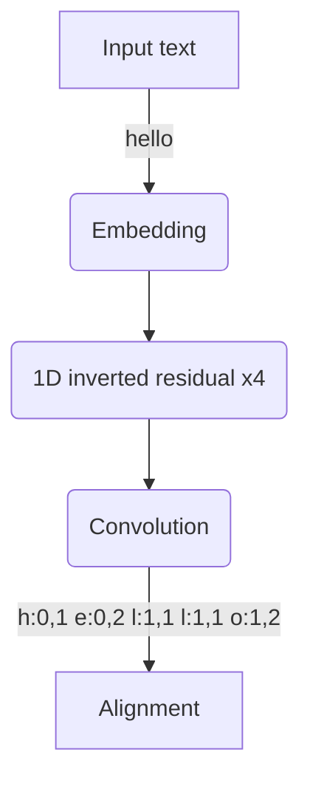
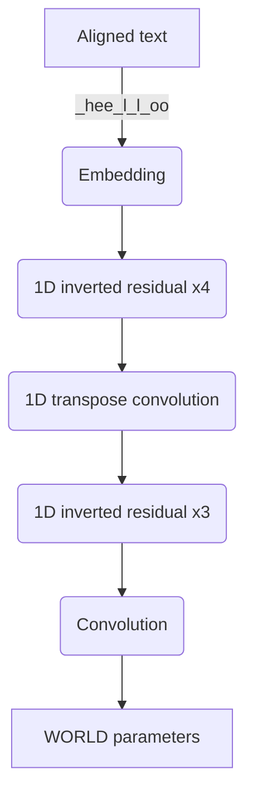
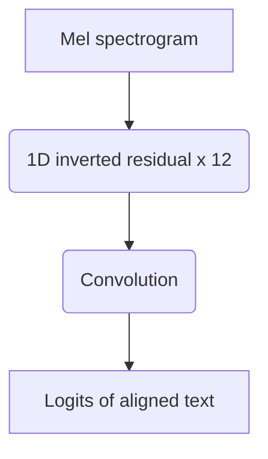

# Voice100

[](https://github.com/kaiidams/voice100/actions/workflows/python-package.yml)

Voice100 includes neural TTS/ASR models. Inference of Voice100
is low cost as its models are tiny and only depend on CNN
without recursion.

## Objectives

- Don't depend on non-commercially licensed dataset
- Small enough to run on normal PCs, Raspberry Pi and smartphones.

## Sample synthesis

- [Sample synthesis 1](docs/sample-en-1.wav)
beginnings are apt to be determinative and when reinforced by continuous applications of similar influence
- [Sample synthesis 2](docs/sample-en-2.wav)
which had restored the courage of noirtier for ever since he had conversed with the priest his violent
despair had yielded to a calm resignation which surprised all who knew his excessive affection
- [Sample synthesis 1](docs/sample-ja-1.wav)
また、東寺のように五大明王と呼ばれる主要な明王の中央に配されることも多い。
- [Sample synthesis 2](docs/sample-ja-2.wav)
ニューイングランド風は牛乳をベースとした白いクリームスープでありボストンクラムチャウダーとも呼ばれる

## Architecture

### TTS

TTS model is devided into two sub models, align model and audio model.
The align model predicts text alignments given a text. An aligned text
is generated from the text and the text alignments. The audio model predicts
[WORLD](https://github.com/mmorise/World)
features (F0, spectral envelope, coded aperiodicity) given
the aligned text.

__Alignment network__


__Audio network__


#### TTS align model

```
  | Name      | Type       | Params
-----------------------------------------
0 | embedding | Embedding  | 14.8 K
1 | layers    | Sequential | 8.6 M 
-----------------------------------------
8.6 M     Trainable params
0         Non-trainable params
8.6 M     Total params
17.137    Total estimated model params size (MB)
```

#### TTS audio model

```
  | Name      | Type         | Params
-------------------------------------------
0 | embedding | Embedding    | 14.8 K
1 | decoder   | VoiceDecoder | 11.0 M
2 | norm      | WORLDNorm    | 518   
3 | criterion | WORLDLoss    | 0     
-------------------------------------------
11.1 M    Trainable params
518       Non-trainable params
11.1 M    Total params
22.120    Total estimated model params size (MB)
```

#### Align model pre-processing

The input of the align model is sequence of tokens of the input text.
The input text is lower cased and tokenized
into characters and encoded by the text encoder. The text encoder
has 28 characters in the vocabulary, which includes lower alphabets,
a space and an apostrophy. All characters which are not found in the
vocabulary, are removed.

#### Align model post-processing

The output of the align model is sequence of pairs of timings which
length is the same as the number of input tokens. A pair has two values,
number of frames before the token and number of frames for the token.
One frame is 20ms. An aligned text is generated from the input text and
pairs of timings. The length of the aligned text is the number of total
frames for the audio.

#### Audio model pre-processing.

The input of the audio model is the encoded aligned text, which is
encoded in the same way as the align model pre-processing, except it
has one added token in the vocabulary for spacing between tokens for
the original text.

#### Audio model post-processing.

The output of the audio model is the sequence of F0, F0 existences,
log spectral envelope, coded aperiodicity.
A F0 existence is a boolean value, which is true when F0 is available
false otherwise. F0 is forced into 0 when F0 existence is false.
One frame is 10ms. The length of the output is twice as the length
of the input.

### ASR

The ASR model is 9-layer MobileNet-like inverted residual which is
trained to predict on
[CTC loss](https://pytorch.org/docs/stable/generated/torch.nn.CTCLoss.html).

__ASR network__


```
  | Name          | Type                          | Params
----------------------------------------------------------------
0 | encoder       | ConvVoiceEncoder              | 11.6 M
1 | decoder       | LinearCharDecoder             | 14.9 K
2 | loss_fn       | CTCLoss                       | 0     
3 | batch_augment | BatchSpectrogramAugumentation | 0     
----------------------------------------------------------------
11.6 M    Trainable params
0         Non-trainable params
11.6 M    Total params
23.243    Total estimated model params size (MB)
```

### Align model

The align model is 2-layer bi-directional LSTM which is trained to predict
aligned texts from MFCC audio features. The align model is used to
prepare aligned texts for dataset to train the TTS models.

```
  | Name          | Type                          | Params
----------------------------------------------------------------
0 | conv          | Conv1d                        | 24.7 K
1 | lstm          | LSTM                          | 659 K 
2 | dense         | Linear                        | 7.5 K 
3 | loss_fn       | CTCLoss                       | 0     
4 | batch_augment | BatchSpectrogramAugumentation | 0     
----------------------------------------------------------------
691 K     Trainable params
0         Non-trainable params
691 K     Total params
1.383     Total estimated model params size (MB)
```

## Training

### Train ASR model

```sh
voice100-prepare-dataset \
  --dataset ljspeech \
  --language en \
  --use_phone

voice100-prepare-dataset \
  --dataset librispeech \
  --language en \
  --use_phone

voice100 fit \
  --config config/asr_en_phone_base.yaml \
  --trainer.accelerator gpu \
  --trainer.devices 1 \
  --trainer.precision 16 \
  --trainer.default_root_dir ./outputs/asr_en_phone_base \
```

### Align text with small ASR model

This generates the aligned text as `data/${DATASET}-phone-align.txt`.

```sh
voice100-align-text \
  --batch_size 4 \
  --dataset ljspeech \
  --language en \
  --use_phone \
  --checkpoint asr_en_phone_small-20230309.ckpt
```

### Train TTS align model

```sh
voice100 fit --config voice100/config/align_en_phone_base.yaml \
  --trainer.accelerator gpu \
  --trainer.devices 1 \
  --trainer.precision 16 \
  --trainer.default_root_dir=./outputs/align_en_phone_base
```

### Compute audio statistics

This generates the statistics as `data/${DATASET}-stat.pt`.

```sh
voice100-calc-stat \
    --dataset ljspeech \
    --language en \
    --output data/audio-stat.py
```

### Train TTS audio model

```sh
voice100 fit --config voice100/config/tts_en_phone_base.yaml \
  --trainer.accelerator gpu \
  --gpus 1 \
  --precision 16 \
  --trainer.default_root_dir=./outputs/tts_en_phone_base
```

## Exporting to ONNX

```sh
voice100-export-onnx \
    --checkpoint model/${MODEL}/lightning_logs/version_0/checkpoints/last.ckpt
```

## CMU models

CMU models is a model that use the output of 
[G2p_en](https://github.com/Kyubyong/g2p) as text representation instead of raw text.

### Training CMU models

These commands convert texts in the dataset into `./data/[dataset]-phone-[split].txt`.
Then run `voice100-train-[model]` with `--use-phone`.

```sh
voice100-prepare-dataset \
    --dataset ljspeech
voice100-prepare-dataset \
    --dataset librispeech \
    --split train
voice100-prepare-dataset \
    --dataset librispeech \
    --split val
```

## CMU multi-task model

CMU multitask model is a variant of TTS audio model which input is an aligned text and outputs are
WORLD vocoder parameters and CMU phonemes. To train CMU multi-task model, we need alignment data
for English and CMU phonemes.

- `./data/ljspeech-align-train.txt`
- `./data/ljspeech-phone-align-train.txt`

Then run 

```sh
MODEL=ttsaudio_en_mt_conv_base

voice100-train-ttsaudio-mt \
  --gpus 1 \
  --dataset ${DATASET} \
  --language ${LANGUAGE} \
  --batch_size 32 \
  --precision 16 \
  --max_epochs 150 \
  --default_root_dir ./model/${MODEL}
```

## Inference

Use [Voice100 runtime](https://github.com/kaiidams/voice100-runtime) and exported ONNX files.

## Pretrained models

| Name | Model Class | Dataset | Download |
|---|---|---|---|
| asr_en_small-20230225 | AudioToAlignText | LibriSpeech, LJ Speech 1.1 | [download](https://github.com/kaiidams/voice100/releases/download/v1.5.2/asr_en_small-20230225.ckpt) |
| asr_en_base-20230319 | AudioToAlignText | LibriSpeech, LJ Speech 1.1 | [download](https://github.com/kaiidams/voice100/releases/download/v1.5.2/asr_en_base-20230319.ckpt) |
| asr_en_phone_small-20230309 | AudioToAlignText | LibriSpeech, LJ Speech 1.1 | [download](https://github.com/kaiidams/voice100/releases/download/v1.5.2/asr_en_phone_small-20230309.ckpt) |
| asr_en_phone_base-20230314 | AudioToAlignText | LibriSpeech, LJ Speech 1.1 | [download](https://github.com/kaiidams/voice100/releases/download/v1.5.2/asr_en_phone_base-20230314.ckpt) |
| asr_ja_phone_small-20230104 | AudioToAlignText | Common Voice 12.0 ja | [download](https://github.com/kaiidams/voice100/releases/download/v1.5.0/asr_ja_phone_small-20230104.ckpt) |
| asr_ja_phone_base-20230104 | AudioToAlignText | Common Voice 12.0 ja | [download](https://github.com/kaiidams/voice100/releases/download/v1.5.0/asr_ja_phone_base-20230104.ckpt) |
| align_en_base-20230401 | TextToAlignText | LJ Speech 1.1 | [download](https://github.com/kaiidams/voice100/releases/download/v1.5.3/align_en_base-20230401.ckpt) |
| tts_en_base-20230407 | AlignTextToAudio | LJ Speech 1.1 | [download](https://github.com/kaiidams/voice100/releases/download/v1.5.3/tts_en_base-20230407.ckpt) |
| align_en_phone_base-20230407 | TextToAlignText | LJ Speech 1.1 | [download](https://github.com/kaiidams/voice100/releases/download/v1.5.3/align_en_phone_base-20230407.ckpt) |
| tts_en_phone_base-20230401 | AlignTextToAudio | LJ Speech 1.1 | [download](https://github.com/kaiidams/voice100/releases/download/v1.5.3/tts_en_phone_base-20230401.ckpt) |
| align_ja_phone_base-20230203 | TextToAlignText | Kokoro Speech v1.2 large | [download](https://github.com/kaiidams/voice100/releases/download/v1.5.1/align_ja_phone_base-20230203.ckpt) |
| tts_ja_phone_base-20230204 | AlignTextToAudio | Kokoro Speech v1.2 large | [download](https://github.com/kaiidams/voice100/releases/download/v1.5.1/tts_ja_phone_base-20230204.ckpt) |
| asr_en_base-20210628 (deprecated) | AudioAlignCTC | LJ Speech 1.1 | [download](https://github.com/kaiidams/voice100/releases/download/v0.7/align_en_lstm_base_ctc-20210628.ckpt)
| align_en_lstm_base_ctc-20210628 (deprecated) | AudioAlignCTC | LJ Speech 1.1 | [download](https://github.com/kaiidams/voice100/releases/download/v0.7/align_en_lstm_base_ctc-20210628.ckpt)
| align_en_phone_lstm_base_ctc-20220103 (deprecated) | AudioAlignCTC | LJ Speech 1.1 | [download](https://github.com/kaiidams/voice100/releases/download/v1.1.0/align_en_phone_lstm_base_ctc-20220103.ckpt)
| align_ja_lstm_base_ctc-20211116  (deprecated) | AudioAlignCTC | Kokoro Speech v1.1 small | [download](https://github.com/kaiidams/voice100/releases/download/v0.7/align_ja_lstm_base_ctc-20211116.ckpt)
| align_ja_phone_lstm_base_ctc-20221230 (deprecated) | AudioAlignCTC | Kokoro Speech v1.1 small | [download](https://github.com/kaiidams/voice100/releases/download/v1.4.1/align_ja_phone_lstm_base_ctc-20221230.ckpt)
| ttsalign_en_conv_base-20220409 (deprecated) | TextToAlignTextModel | LJ Speech 1.1 | [download](https://github.com/kaiidams/voice100/releases/download/v1.3.0/ttsalign_en_conv_base-20220409.ckpt)
| ttsalign_en_phone_conv_base-20220409 (deprecated) | TextToAlignTextModel | LJ Speech 1.1 | [download](https://github.com/kaiidams/voice100/releases/download/v1.3.0/ttsalign_en_phone_conv_base-20220409.ckpt)
| ttsalign_ja_conv_base-20220411 (deprecated) | TextToAlignTextModel | Kokoro Speech v1.1 small | [download](https://github.com/kaiidams/voice100/releases/download/v1.3.0/ttsalign_ja_conv_base-20220411.ckpt)
| ttsaudio_en_conv_base-20220107 (deprecated) | AlignTextToAudioModel | Kokoro Speech v1.1 small | [download](https://github.com/kaiidams/voice100/releases/download/v1.0.1/ttsaudio_en_conv_base-20220107.ckpt)
| ttsaudio_en_phone_conv_base-20220105 (deprecated) | AlignTextToAudioModel | LJ Speech 1.1 | [download](https://github.com/kaiidams/voice100/releases/download/v1.1.0/ttsaudio_en_phone_conv_base-20220105.ckpt)
| ttsaudio_ja_conv_base-20220416 (deprecated) | AlignTextToAudioModel | Kokoro Speech v1.1 small | [download](https://github.com/kaiidams/voice100/releases/download/v1.3.1/ttsaudio_ja_conv_base-20220416.ckpt)
| ttsaudio_en_mt_conv_base-20220316 (deprecated) | AlignTextToAudioMultiTaskModel | LJ Speech 1.1 | [download](https://github.com/kaiidams/voice100/releases/download/v1.2.0/ttsaudio_en_mt_conv_base-20220316.ckpt)
| asr_en_conv_base_ctc-20220126 (deprecated) | AudioToTextCTC | LibriSpeech | [download](https://github.com/kaiidams/voice100/releases/download/v1.1.1/asr_en_conv_base_ctc-20220126.ckpt)
| asr_en_phone_conv_base_ctc-20220107 (deprecated) | AudioToTextCTC | LibriSpeech | [download](https://github.com/kaiidams/voice100/releases/download/v1.1.0/asr_en_phone_conv_base_ctc-20220107.ckpt)
| stt_ja_conv_base_ctc-20211127 (deprecated) | AudioToTextCTC | Common Voice 6.1 ja | [download](https://github.com/kaiidams/voice100/releases/download/v0.8/stt_ja_conv_base_ctc-20211127.ckpt)
| asr_ja_phone_conv_base_ctc-20221225 (deprecated) | AudioToTextCTC | Common Voice 6.1 ja | [download](https://github.com/kaiidams/voice100/releases/download/v1.4.0/asr_ja_phone_conv_base_ctc-20221225.ckpt)
