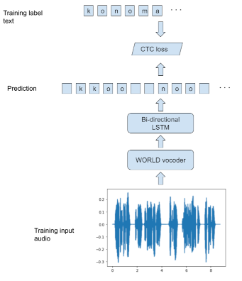
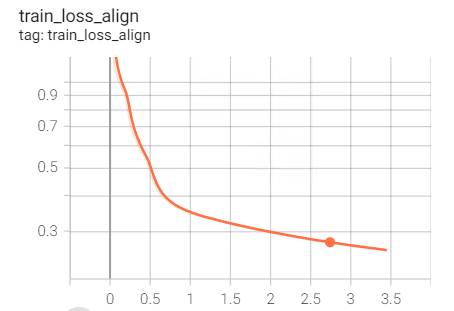
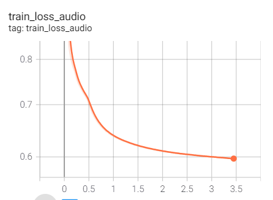

# Voice100

Voice100 includes neural TTS/ASR models. Inference of Voice100
is low cost as its models are tiny and only depend on CNN
without recursion.

## Objectives

- Don't depend on non-commercially licensed dataset
- Small enough to run on normal PCs, Raspberry Pi and smartphones.

## Architecture

### TTS

TTS model is devided into two sub models, align model and audio model.
The align model predicts text alignments given a text. An aligned text
is generated from the text and the text alignments. The audio model predicts
[WORLD](https://github.com/mmorise/World)
features (F0, spectral envelope, coded aperiodicity) given
the aligned text.


#### Align model pre-processing

The input of the align model is sequence of tokens of the input text.
The input text is lower cased and tokenized
into characters and encoded by the text encoder. The text encoder
has 28 characters in the vocabulary, which includes lower alphabets,
a space and an apostrophy. All characters which are not found in the
vocabulary, are removed.

#### Align model post-processing

The output of the align model is sequence of pairs of timings which
length is the same as the number of input tokens. A pair has two values,
number of frames before the token and number of frames for the token.
One frame is 20ms. An aligned text is generated from the input text and
pairs of timings. The length of the aligned text is the number of total
frames for the audio.

#### Audio model pre-processing.

The input of the audio model is the encoded aligned text, which is
encoded in the same way as the align model pre-processing, except it
has one added token in the vocabulary for spacing between tokens for
the original text.

#### Audio model post-processing.

The output of the audio model is the sequence of F0, F0 existences,
log spectral envelope, coded aperiodicity.
A F0 existence is a boolean value, which is true when F0 is available
false otherwise. F0 is forced into 0 when F0 existence is false.
One frame is 10ms. The length of the output is twice as the length
of the input.

### ASR


# Sample synthesis

- [Sample synthesis 1 (From eval datset)](docs/sample1.wav)
- [Sample synthesis 2 (From JVS corpus)](docs/sample2.wav)

### Align model

The align model is 2-layer bi-directional LSTM which is trained to predict
aligned texts from MFCC audio features. The align model is used to
prepare aligned texts for dataset to train the TTS models.

```
  | Name          | Type                          | Params
----------------------------------------------------------------
0 | conv          | Conv1d                        | 24.7 K
1 | lstm          | LSTM                          | 659 K 
2 | dense         | Linear                        | 7.5 K 
3 | loss_fn       | CTCLoss                       | 0     
4 | batch_augment | BatchSpectrogramAugumentation | 0     
----------------------------------------------------------------
```

## Training

### Align model with LJ Speech Corpus

Training align model with 
[LJ Speech Corpus](https://keithito.com/LJ-Speech-Dataset/).

```
MODEL=align_en_lstm_base_ctc
DATASET=ljspeech
LANGUAGE=en

cd data
curl -O https://data.keithito.com/data/speech/LJSpeech-1.1.tar.bz2
tar xfz LJSpeech-1.1.tar.bz2
cd ..

voice100-train-align \
    --gpus 1 \
    --precision 16 \
    --batch_size 256 \
    --max_epochs 100 \
    --dataset ${DATASET} \
    --language ${LANGUAGE} \
    --default_root_dir=model/${MODEL}
```

### Align text with align model

This generates the aligned text as `data/timing-ljspeech.txt`.

```
CHECKPOINT=align_en_lstm_base_ctc.ckpt
DATASET=ljspeech
LANGUAGE=en

voice100-align-text \
    --batch_size 4 \
    --dataset ${DATASET} \
    --language ${LANGUAGE} \
    --checkpoint model/${CHECKPOINT}
```

### Train 

!voice100-train-ttsalign \
    --gpus 1 \
    --batch_size 256 \
    --precision 16 \
    --max_epochs 100 \
    --dataset {DATASET} \
    --language {LANGUAGE} \
    --default_root_dir=model/{MODEL} \


### Preprocessing

Get CSS10 Japanese corpus and extract the data under `./data`.
`./data/japanese-single-speaker-speech-dataset/transcript.txt` should be
the path to the transcript data.

Run the preprocess,

```
$ python -m voice100.preprocess --dataset css10ja
```

This generates `data/css10ja_train.npz` and `data/css10ja_val.npz`

### Training alighment model



The alignment model align text and audio of the dataset.

```
$ python -m voice100.train_ctc --mode train --dataset css10ja --model_dir model/ctc
```

### Estimate alighment

This makes `data/css10ja_train_aligh.npz`.

```
$ python -m voice100.train_ctc --mode convert --dataset css10ja --model_dir model/ctc
```

### Train TTS model

TTS model is a plain Transformer with multitask of three tasks,
predicting alignment, audio and end of audio.

```
$ python -m voice100.train_ctc --mode train --model_dir model/audio
```

It takes 3.5 hours with T4 to train 239 epochs.




## Data

https://raw.githubusercontent.com/voice-statistics/voice-statistics.github.com/master/assets/doc/balance_sentences.txt

- JSUT is 10 hour recording in female voice.
- CSS10 is 14 hour recording in male voice.
- JVS is 0.1 hour recording.

## References

- 声優統計コーパス http://voice-statistics.github.io/
- CSS10: A Collection of Single Speaker Speech Datasets for 10 Languages https://github.com/Kyubyong/css10
- Deep Speech 3 https://arxiv.org/abs/1710.07654
- Tacotron 2 https://arxiv.org/abs/1712.05884
- Tacotron https://github.com/keithito/tacotron
- Tacotron 3 https://github.com/StevenLOL/tacotron-3
- Tacotron 3 https://github.com/kingulight/Tacotron-3
- Mellotron https://github.com/NVIDIA/mellotron
- Deep Voice 3 https://github.com/Kyubyong/deepvoice3
- WORLD http://www.kki.yamanashi.ac.jp/~mmorise/world/
- OpenJTALK http://open-jtalk.sp.nitech.ac.jp/
- 月ノ美兎さんの音声合成ツール(Text To Speech) を作ってみた https://qiita.com/K2_ML/items/2804594454b39180c909
- Mozilla TTS (Tacotron2) を使って日本語音声合成 https://qiita.com/tset-tset-tset/items/7b388b0536fcc774b2ad
- Tacotron2系における日本語のunidecodeの不確かさ https://qiita.com/nishiha/items/6e2a2ddaafe03fa7f924
- Tacotron2を日本語で学習してみる（０から学習編） https://shirowanisan.com/entry/2020/12/05/184426
- NVIDIA/tacotron2 で日本語の音声合成を試す https://note.com/npaka/n/n2a91c3ca9f34
- JSUT https://sites.google.com/site/shinnosuketakamichi/publication/jsut