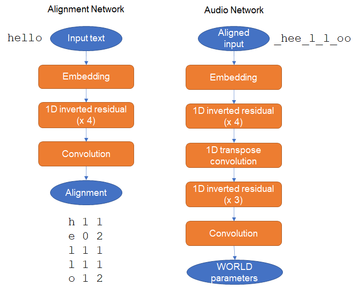
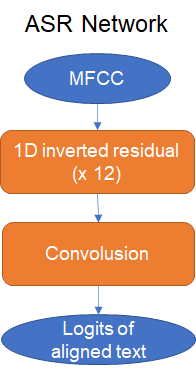

# Voice100

Voice100 includes neural TTS/ASR models. Inference of Voice100
is low cost as its models are tiny and only depend on CNN
without recursion.

## Objectives

- Don't depend on non-commercially licensed dataset
- Small enough to run on normal PCs, Raspberry Pi and smartphones.

## Sample synthesis

- [Sample synthesis 1 (From eval datset)](docs/sample1.wav)
- [Sample synthesis 2 (From JVS corpus)](docs/sample2.wav)

## Architecture

### TTS

TTS model is devided into two sub models, align model and audio model.
The align model predicts text alignments given a text. An aligned text
is generated from the text and the text alignments. The audio model predicts
[WORLD](https://github.com/mmorise/World)
features (F0, spectral envelope, coded aperiodicity) given
the aligned text.



#### TTS align model

```
  | Name      | Type       | Params
-----------------------------------------
0 | embedding | Embedding  | 3.7 K 
1 | layers    | Sequential | 614 K 
-----------------------------------------
618 K     Trainable params
0         Non-trainable params
618 K     Total params
1.237     Total estimated model params size (MB)
```

#### TTS audio model

```
  | Name      | Type         | Params
-------------------------------------------
0 | embedding | Embedding    | 14.8 K
1 | decoder   | VoiceDecoder | 11.0 M
2 | norm      | WORLDNorm    | 518   
3 | criteria  | WORLDLoss    | 0     
-------------------------------------------
11.1 M    Trainable params
518       Non-trainable params
11.1 M    Total params
22.120    Total estimated model params size (MB)
```

#### Align model pre-processing

The input of the align model is sequence of tokens of the input text.
The input text is lower cased and tokenized
into characters and encoded by the text encoder. The text encoder
has 28 characters in the vocabulary, which includes lower alphabets,
a space and an apostrophy. All characters which are not found in the
vocabulary, are removed.

#### Align model post-processing

The output of the align model is sequence of pairs of timings which
length is the same as the number of input tokens. A pair has two values,
number of frames before the token and number of frames for the token.
One frame is 20ms. An aligned text is generated from the input text and
pairs of timings. The length of the aligned text is the number of total
frames for the audio.

#### Audio model pre-processing.

The input of the audio model is the encoded aligned text, which is
encoded in the same way as the align model pre-processing, except it
has one added token in the vocabulary for spacing between tokens for
the original text.

#### Audio model post-processing.

The output of the audio model is the sequence of F0, F0 existences,
log spectral envelope, coded aperiodicity.
A F0 existence is a boolean value, which is true when F0 is available
false otherwise. F0 is forced into 0 when F0 existence is false.
One frame is 10ms. The length of the output is twice as the length
of the input.

### ASR



### Align model

The align model is 2-layer bi-directional LSTM which is trained to predict
aligned texts from MFCC audio features. The align model is used to
prepare aligned texts for dataset to train the TTS models.

```
  | Name          | Type                          | Params
----------------------------------------------------------------
0 | conv          | Conv1d                        | 24.7 K
1 | lstm          | LSTM                          | 659 K 
2 | dense         | Linear                        | 7.5 K 
3 | loss_fn       | CTCLoss                       | 0     
4 | batch_augment | BatchSpectrogramAugumentation | 0     
----------------------------------------------------------------
691 K     Trainable params
0         Non-trainable params
691 K     Total params
1.383     Total estimated model params size (MB)
```

## Training

### Align model with LJ Speech Corpus

Training align model with 
[LJ Speech Corpus](https://keithito.com/LJ-Speech-Dataset/).

```
MODEL=align_en_lstm_base_ctc
DATASET=ljspeech
LANGUAGE=en

cd data
curl -O https://data.keithito.com/data/speech/LJSpeech-1.1.tar.bz2
tar xfz LJSpeech-1.1.tar.bz2
cd ..

voice100-train-align \
    --gpus 1 \
    --precision 16 \
    --batch_size 256 \
    --max_epochs 100 \
    --dataset ${DATASET} \
    --language ${LANGUAGE} \
    --default_root_dir=model/${MODEL}
```

### Align text with align model

This generates the aligned text as `data/align-ljspeech.txt`.

```
CHECKPOINT=align_en_lstm_base_ctc.ckpt
DATASET=ljspeech
LANGUAGE=en

voice100-align-text \
    --batch_size 4 \
    --dataset ${DATASET} \
    --language ${LANGUAGE} \
    --checkpoint model/${CHECKPOINT}
```

### Train TTS align model

```
MODEL=ttsalign_en_conv_base
DATASET=ljspeech
LANGUAGE=en

voice100-train-ttsalign \
    --gpus 1 \
    --batch_size 256 \
    --precision 16 \
    --max_epochs 100 \
    --dataset {DATASET} \
    --language {LANGUAGE} \
    --default_root_dir=model/{MODEL} \
```

### Compute audio statistics

This generates the statistics as `data/stat-ljspeech.pt`.

```
DATASET=ljspeech
LANGUAGE=en

voice100-calc-stat \
    --dataset {DATASET} \
    --language {LANGUAGE}
```

### Train TTS align model

```
DATASET=ljspeech
LANGUAGE=en
MODEL=ttsaudio_en_conv_base

voice100-train-ttsaudio \
  --gpus 1 \
  --dataset {DATASET} \
  --language {LANGUAGE} \
  --batch_size 32 \
  --precision 16 \
  --max_epochs 500 \
  --default_root_dir ./model/{MODEL}
```

### Train ASR model

TBD